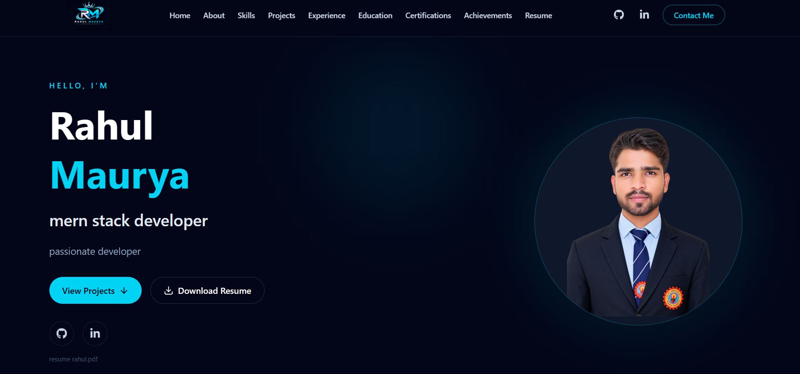
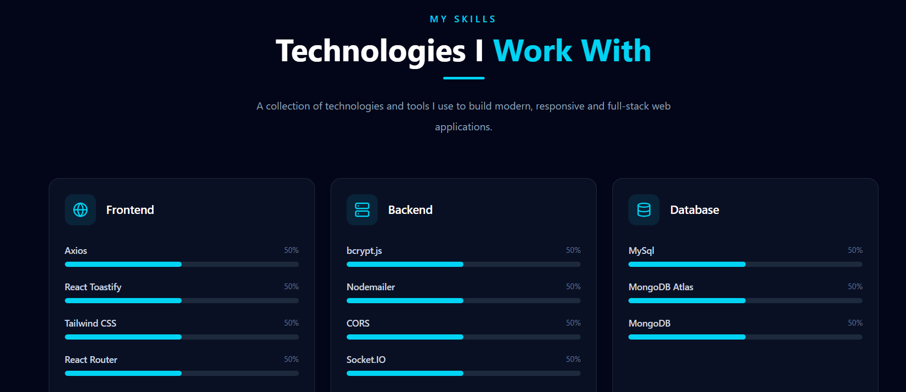
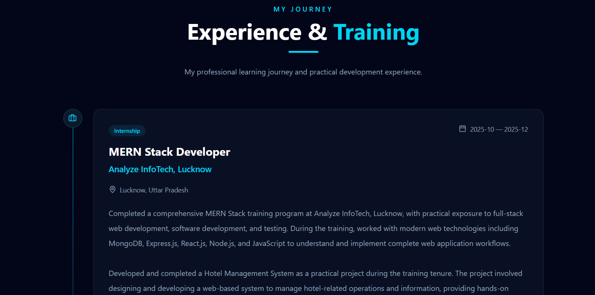
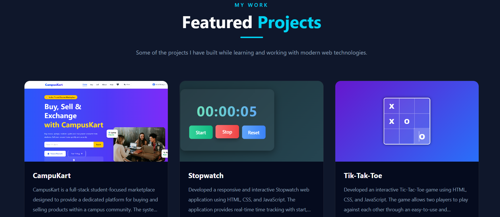
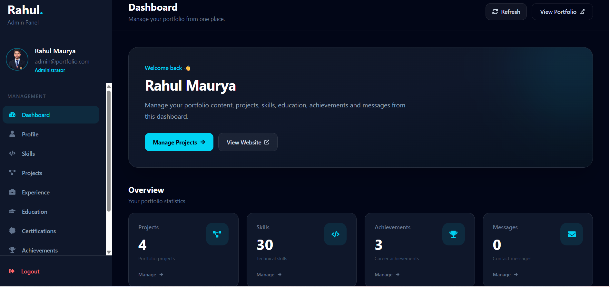

# 🚀 Rahul Maurya — Personal Portfolio

<p align="center">
  
</p>

<h3 align="center">
  MERN Stack Developer | Full Stack Web Developer
</h3>

<p align="center">
  A modern, responsive and dynamic personal portfolio built using the MERN Stack.
</p>

<p align="center">

  <a href="https://my-portfolio-legend17.vercel.app">
    🌐 Live Portfolio
  </a>
  &nbsp; • &nbsp;

  <a href="https://github.com/RahulMaurya90058">
    💻 GitHub
  </a>
  &nbsp; • &nbsp;

  <a href="https://www.linkedin.com/in/rahul-maurya-16b957312">
    💼 LinkedIn
  </a>

</p>

---

## 🌐 Live Demo

### Frontend

🔗 **Live Portfolio:**  
https://my-portfolio-legend17.vercel.app

### Backend / API

🔗 **Backend API:**  
https://my-portfolio-x8i4.onrender.com

> Replace `YOUR_RENDER_BACKEND_URL` with your deployed Render backend URL.

---

# 📌 About The Project

This is my personal portfolio website developed to showcase my **skills, projects, experience, achievements and professional profile**.

The portfolio is designed with a modern dark-themed UI, smooth animations, responsive layouts and a dynamic backend-powered content management system.

The website also includes an **Admin Panel**, allowing portfolio information such as profile details, skills, projects, experience, achievements and resume to be managed dynamically.

---

# ✨ Features

- 🎨 Modern and responsive UI
- 📱 Fully responsive design
- ⚡ Fast and optimized React application
- 🎬 Smooth animations using Framer Motion
- 👤 Dynamic profile section
- 🛠️ Dynamic skills section
- 💼 Experience section
- 🚀 Projects showcase
- 🏆 Achievements section
- 📄 Dynamic resume section
- 📥 Resume download functionality
- 👨‍💼 Admin dashboard
- 🔐 Admin authentication
- 🔑 JWT Authentication
- 🖼️ Profile image management
- 📤 File/image upload functionality
- ☁️ Cloudinary integration
- 📧 Email OTP verification
- 💳 Razorpay payment gateway integration
- 📬 Contact/email functionality
- 🌐 REST API
- 📊 MongoDB database
- 🔒 Environment variable configuration
- 🚀 Vercel frontend deployment
- 🚀 Render backend deployment

---

# 🛠️ Tech Stack

## Frontend

- React.js
- JavaScript
- HTML5
- CSS3
- Tailwind CSS
- React Router
- Framer Motion
- Axios
- React Toastify
- Lucide React
- React Icons

## Backend

- Node.js
- Express.js
- REST API
- JWT Authentication
- Bcrypt.js
- Multer
- Nodemailer
- CORS
- dotenv

## Database

- MongoDB
- MongoDB Atlas
- Mongoose

## APIs & Services

- Cloudinary
- Brevo API
- Razorpay Payment Gateway
- Email OTP Verification

## Development Tools

- Git
- GitHub
- Postman
- VS Code
- npm

## Deployment

- Vercel
- Render

---

# 🧩 Portfolio Sections

The portfolio contains the following major sections:

### 🏠 Home

Introduces me as a MERN Stack Developer with my profile image, professional title, short introduction and social links.

### 🛠️ Skills

Showcases my technical skills and technologies that I have worked with.

### 💼 Experience

Displays my training and development experience along with the technologies and projects I worked on.

### 🚀 Projects

Showcases my development projects with descriptions, technologies and project links.

### 🏆 Achievements

Displays certificates, recognitions and other achievements.

### 📄 Resume

Provides access to my latest resume with options to view and download it.

### 📬 Contact

Allows visitors to get in touch with me.

### 🔐 Admin Panel

A dedicated admin dashboard is included to manage portfolio content dynamically.

---

# 📸 Screenshots

## 🏠 Home / Hero Section


---

## 🛠️ Skills Section



---

## 💼 Experience Section



---

## 🚀 Projects Section



---

## 🔐 Admin Dashboard



---

# 🔐 Admin Panel

The portfolio includes a secure admin panel where the administrator can manage portfolio content.

Admin functionality includes:

- Profile management
- Profile image management
- Skills management
- Experience management
- Projects management
- Achievements management
- Resume management
- Admin authentication
- JWT based authorization
- File uploads
- Content updates

Sensitive credentials are stored using environment variables and are not included in the public repository.

---

# 📄 Resume Management

The portfolio supports dynamic resume management.

The administrator can upload the latest resume from the admin panel, and the uploaded resume is displayed in the portfolio's Resume section.

Visitors can:

- View the resume
- Download the resume
- Access the latest uploaded version

---

# 🔑 Environment Variables

For security, sensitive information is stored inside `.env` files.

### Backend `.env`

```env
PORT=5000

MONGO_URI=your_mongodb_connection_string

JWT_SECRET=your_jwt_secret

ADMIN_EMAIL=your_admin_email

ADMIN_PASSWORD=your_admin_password

CLOUDINARY_CLOUD_NAME=your_cloudinary_cloud_name
CLOUDINARY_API_KEY=your_cloudinary_api_key
CLOUDINARY_API_SECRET=your_cloudinary_api_secret

My-Portfolio/
│
├── client/
│   │
│   ├── public/
│   ├── src/
│   │   ├── components/
│   │   ├── pages/
│   │   ├── sections/
│   │   └── ...
│   │
│   ├── package.json
│   └── ...
│
├── server/
│   │
│   ├── controllers/
│   ├── middleware/
│   ├── models/
│   ├── routes/
│   ├── uploads/
│   ├── server.js
│   ├── package.json
│   └── ...
│
├── screenshots/
│   ├── admin-dashboard.png
│   ├── experience.png
│   ├── home.png
│   ├── projects.png
│   └── skills.png
│
├── .gitignore
└── README.md

